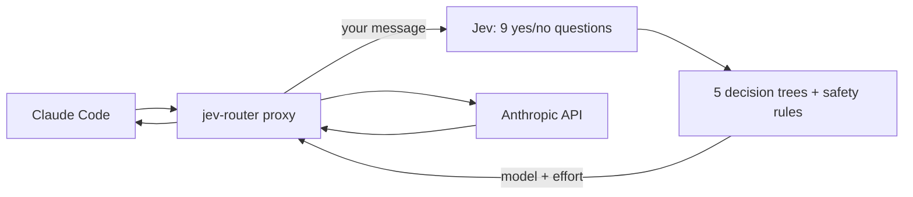

# jev-router

Automatic model and effort switching for [Claude Code](https://claude.com/claude-code). [TypeSafe Jev](https://docs.typesafe.ai) routes each message you send:

- **Haiku 4.5** for small questions;
- **Sonnet 5** (low, medium or high effort) for everyday work;
- **Opus 5.5** (medium, high, xhigh or max effort) for hard or risky work.

## Architecture



1. The proxy asks Jev a few quick yes/no questions about your message, for example "is it trivial?", "does it touch security?" and "did the last answer fail?".
2. Five small decision trees vote on a model and effort, and the router takes the middle vote.
3. Safety rules can raise the choice. Security or concurrency work gets at least Opus. When a fix failed, it goes one step higher.
4. The request goes to Anthropic with the chosen model and effort, and the whole turn stays on that model.

## Install

You'll need Rust, Claude Code and a TypeSafe API key.

```bash
git clone https://github.com/xafold/jev-router && cd jev-router
cp .env.example .env            # add your TYPESAFE_API_KEY
cargo build --release
ln -sfn "$PWD/target/release/jev-router" ~/.local/bin/jev-router
```

## Use

```bash
jev-router claude               # Claude Code with automatic switching
jev-router route "your prompt"  # dry run: which model would it pick, and why
jev-router log                  # recent decisions
```

To choose a model yourself, pick any model in `/model`. Pick **Jev Router** to go back to automatic.

## Dashboard

```bash
jev-router dashboard              # open http://127.0.0.1:8765
jev-router dashboard --port 9000  # use a different port
```

The dashboard is a local page that shows:
- which model handled each message, and why;
- roughly how much the router saved compared with using Opus for everything.

You can rate each choice as right, too weak or too strong. After about 20 ratings, the router quietly adjusts itself.

## Tests

```bash
cargo test --release
```

## Credits

The proxy approach comes from [gargpratyush/jev-router](https://github.com/gargpratyush/jev-router) (MIT).
