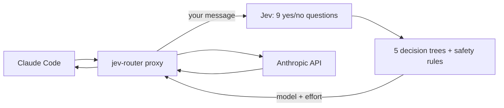

# jev-router

Automatic model and effort switching for [Claude Code](https://claude.com/claude-code). [TypeSafe Jev](https://docs.typesafe.ai) routes each message you send:

- **Haiku** for small questions;
- **Sonnet** (low, medium or high effort) for everyday work;
- **Opus** (medium, high, xhigh or max effort) for hard or risky work;
- **Fable** (high or max effort) for the hardest work, only if you turn it on (see below).

Each family runs on its newest model (Haiku 4.5, Sonnet 5, Opus 5.5 and Fable 5.1 today), and a newer release is picked up without updating jev-router.

## Architecture



1. The proxy asks Jev a few quick yes/no questions about your message, for example "is it trivial?", "does it touch security?" and "did the last answer fail?".
2. Five small decision trees vote on a model and effort, and the router takes the middle vote.
3. Safety rules can raise the choice. Security or concurrency work gets at least Opus. When a fix failed, it goes one step higher.
4. The request goes to Anthropic with the chosen model and effort, and the whole turn stays on that model.

## Install

You'll need Claude Code and a TypeSafe API key.

**Prebuilt binary** (Linux x86_64 with glibc 2.39+, such as Ubuntu 24.04 or later). Download it from [Releases](https://github.com/xafold/jev-router/releases):

```bash
curl -L https://github.com/xafold/jev-router/releases/latest/download/jev-router-x86_64-linux.tar.gz | tar xz -C ~/.local/bin
mkdir -p ~/.config/jev-router && echo "TYPESAFE_API_KEY=your-key" > ~/.config/jev-router/.env
jev-router --version
```

**From source** (needs Rust):

```bash
git clone https://github.com/xafold/jev-router && cd jev-router
cp .env.example .env            # add your TYPESAFE_API_KEY
cargo build --release
ln -sfn "$PWD/target/release/jev-router" ~/.local/bin/jev-router
```

## Use

```bash
jev-router claude               # Claude Code with automatic switching
jev-router route "your prompt"  # dry run: which model would it pick, and why
jev-router log                  # recent decisions
```

To choose a model yourself, pick any model in `/model`. Pick **Jev Router** to go back to automatic.

### Fable tier (off by default)

Fable is Anthropic's most capable model, and it costs about 2.5 times as much as Opus per token. To let the router use it:

```bash
jev-router claude --fable on    # saved: later sessions keep it on
jev-router claude --fable off   # back to Opus as the top model
```

With Fable on, the decision trees change as follows:
- The two hardest tree outcomes vote Fable (high effort) instead of Opus xhigh. These are an open-ended design that spans several parts, and a concurrency fix that already failed.
- If a tree reaches one of those outcomes on clear answers, the message goes to Fable. If Jev was unsure on the way, it doesn't.
- If an answer from Opus didn't work, the retry goes to Fable. The top rung is Fable max.
- Everything else routes exactly as it does with Fable off. Unclear requests still go to Haiku first to ask questions, and security or concurrency work still gets at least Opus.

Fable needs 30-day data retention, so it returns an error on zero-data-retention organizations.

### Models

```bash
jev-router models    # the model each family runs on, and where that came from
```

Once a day, the proxy calls the Anthropic Models API with the credentials Claude Code already uses. It picks the newest Haiku, Sonnet, Opus and Fable, along with the effort levels and thinking modes each one accepts. The result is cached in `~/.local/share/claude-router/models.json`. If the lookup fails, jev-router uses the built-in models above and tries again an hour later. To keep the built-in models, set `JEV_ROUTER_MODELS=builtin`.

The dashboard prices a model that isn't on its price list like the newest listed model of the same family, so costs for a brand-new model are an estimate.

## Dashboard

```bash
jev-router dashboard              # open http://127.0.0.1:8765
jev-router dashboard --port 9000  # use a different port
```

The dashboard is a local page that shows:
- which model handled each message, and why;
- roughly how much the router saved compared with using Opus for everything.

You can rate each choice as right, too weak or too strong. After about 20 ratings, the router quietly adjusts itself.

## Versioning

Versions follow [semver](https://semver.org). The current version is in `Cargo.toml`, and `jev-router --version` prints it. Each release is tagged `vX.Y.Z` and comes with a binary.

## Tests

```bash
cargo test --release
```

## Credits

The proxy approach comes from [gargpratyush/jev-router](https://github.com/gargpratyush/jev-router) (MIT).
