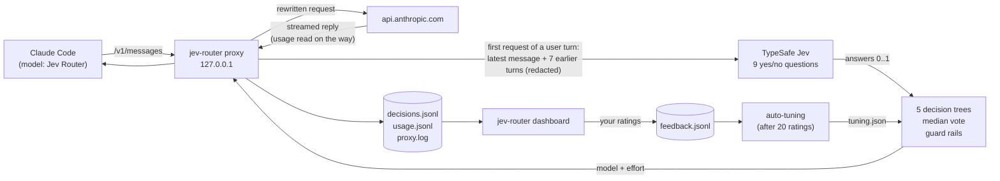

# jev-router

Automatic model and effort switching for [Claude Code](https://claude.com/claude-code). Jev routes every message you send:

- **Claude Haiku 4.5** for small questions;
- **Sonnet 5** at low, medium or high effort for everyday work;
- **Opus 5.5** at medium, high, xhigh or max effort for hard, risky or concurrent work.

Every decision is logged, a local dashboard shows what it chose and what that saved, and your ratings in the dashboard tune the router automatically.

It's a single Rust binary. Startup takes about 1 ms, so it's cheap enough to sit in your status line.

```bash
jev-router claude          # use Claude Code exactly as before; the model switches by itself
jev-router dashboard       # http://127.0.0.1:8765: what it chose, why, and what it saved
```

## Architecture



**How a message is routed**

1. **Ask Jev.** Nine narrow yes/no questions go to [TypeSafe Jev](https://docs.typesafe.ai) (`jev-1.13.0`) in one request. They ask only about your latest message; the earlier turns are context. The questions: is it clear enough to start? Is it trivial? Does it span several components? Is there a performance requirement? Concurrency? Did the last answer fail? Security? Were tests asked for? Is it open-ended design? This costs about $0.00004 per message.
2. **Five trees vote.** The scope, history, risk, design and load trees each walk the answers to a model + effort option. When an answer is borderline (0.35 to 0.65), a tree follows both branches and keeps the harder result. The router takes the median vote, plus one step up when the trees disagree by 4 or more options.
3. **Guard rails.** These always apply, in order:
   - An unclear first message goes to Haiku, so the model asks before working.
   - Security or concurrency work gets at least Opus 5.5 medium.
   - "That didn't work" goes one step above the previous answer.
   - Past about 20k tokens of context it never downgrades, because switching models throws away the prompt cache.
4. **Rewrite and forward.** The proxy sets `model` and `effort` on the request and adapts it for the chosen model. Only Opus 5.5 accepts mid-conversation `system` messages and `tool_addition` blocks, so for the others these are folded into plain text and un-deferred tools. Haiku also takes no effort or adaptive thinking. The request then goes to Anthropic with Claude Code's own auth.

**The 8 model + effort options**

| Option | Model | Effort | $/1M in / out |
|---|---|---|---|
| haiku-4.5 | `claude-haiku-4-5` | none (Haiku 4.5 takes no effort setting) | 1 / 5 |
| sonnet-5/low, /medium, /high | `claude-sonnet-5` | low, medium, high | 2 / 10 |
| opus-5.5/medium, /high, /xhigh, /max | `claude-opus-5-5` | medium, high, xhigh, max | 4 / 20 |

`opus-5.5/max` is reached only when an xhigh answer has already failed.

**Source layout**

| File | What it does |
|---|---|
| `src/router.rs` | Pure routing logic: the options, questions, forest, vote, guard rails and `Tuning` knobs. No I/O. |
| `src/proxy.rs` | Loopback HTTP proxy. It detects fresh turns, pins one option per turn, rewrites requests, streams replies and records token usage. |
| `src/jev.rs` | The Jev HTTP call (`POST /v1/systemone`, 8 s timeout, one retry), secret redaction, decision records, and the `log`/`show` views. |
| `src/main.rs` | The commands: `claude` launcher, `statusline`, `route`, `log`, `show`, `dashboard`, `tune`. |
| `src/dashboard.rs` + `src/dashboard.html` | The local dashboard. The page is compiled into the binary. |
| `src/autotune.rs` | Silent tuning from your ratings. |
| `src/util.rs` | Timestamps, ids, the data directory, SIGINT handling. |
| `tests/parity.rs` + `tests/parity.jsonl` | 4,562 fixed cases (routing, tuned routing, tuner choices, redaction, request rewriting) that the build must reproduce exactly. |
| `e2e/` | Live end-to-end test on a toy project with a planted bug. |

## Install

You need Rust (stable), Claude Code, and a TypeSafe API key.

```bash
git clone https://github.com/xafold/jev-router && cd jev-router
cp .env.example .env               # put your TYPESAFE_API_KEY in it
cargo build --release
ln -sfn "$PWD/target/release/jev-router" ~/.local/bin/jev-router
cargo test --release               # unit tests + 4,562 parity cases
```

The `.env` path is fixed at compile time: the binary reads `.env` next to `Cargo.toml`. If you move the folder, rebuild. An exported `TYPESAFE_API_KEY` always takes precedence.

## Use it

```bash
jev-router claude                                  # interactive Claude Code, auto-switching
jev-router claude -p "..." --allowedTools "Read"   # any claude arguments pass through
jev-router route "rename foo to bar in utils.py"   # dry run: what would it pick, and why
jev-router log -n 20                               # recent decisions (from another terminal)
jev-router show [ID]                               # one decision in full (default: latest)
jev-router dashboard [--port N]                    # the dashboard
jev-router tune [--apply | --reset]                # auto-tuning dry run, apply now, or back to defaults
```

- **Manual override.** Pick any real model in `/model` and it passes through untouched. Pick **Jev Router** to go back to automatic.
- **Status line.** In `jev-router claude` sessions your own status line (claude-hud, for example) still runs. Its `jev-router` label becomes `jev-router: opus-5.5/high`. Without a status line of your own you get just that label. Global settings are never changed.
- **/model default.** If you save "Jev Router" as your default, your previous default comes back on exit, so plain `claude` keeps working.

## Dashboard

```bash
jev-router dashboard            # http://127.0.0.1:8765 (next free port if taken)
```

It's written for someone who has never seen the router's internals: plain words ("model", "effort", "Jev wasn't sure") and a glossary.

- **Summary**
  - Money and tokens saved against a baseline you choose ("everything on Opus 5.5" by default).
  - Where the tokens went, per model.
  - How often each model was chosen.
  - A four-step "how it decides" explainer.
- **Messages**
  - Every message, with the model it went to, a one-line reason, and what that turn cost and saved.
- **One message**
  - Result: the model, the effort, and the cost of the turn.
  - "Was this the right model?"
  - What you asked.
  - What Jev noticed.
  - How the model was chosen.
  - The raw scores, the five trees, and technical details, each one click away.
- **Improve**
  - Rate unrated messages: ✓ Right / ↑ Needed a stronger one / ↓ A cheaper one would do. Click an active button again to undo it.
  - The auto-tuning status, with a Reset button.
  - Questions Jev is often unsure about.
  - How often the safety rules override the trees.
  - Trees that are usually outvoted.
  - Spend per model.

**Cost and savings.** The proxy reads the `usage` fields of every Claude reply as it relays them. For that it asks Anthropic for uncompressed replies. It records them in `usage.jsonl`, and the dashboard prices them at list prices:

- input and output tokens;
- cache reads;
- 5-minute and 1-hour cache writes.

"Without it" re-prices the same tokens on the baseline model. The figure is an estimate, because another model would have written a different number of tokens. On a subscription the saving shows up as usage-limit headroom, not dollars.

**Privacy.** The dashboard binds only to 127.0.0.1 and rejects any other `Host` or `Origin`, because the log holds your prompts. Content is rendered as text, never as HTML.

API: `GET /api/decisions`, `/api/usage`, `/api/meta`, `/api/proxy`, `/api/feedback` and `/api/tuning`; `POST /api/feedback {"id", "label": right|too_low|too_high|clear}` and `/api/tuning/reset`.

## Automatic tuning from your ratings

There's nothing to run.

- **When:** once 20 messages are rated, then after every 5 new ratings. The check runs silently when `jev-router claude` starts and after each rating.
- **How:** it replays every rated message from its logged Jev answers, so there are no new Jev calls and no cost, under 300 variations of four soft knobs:
  - the "not sure" width;
  - the tree-disagreement spread;
  - the "unclear, so Haiku asks first" threshold, which can also be turned off;
  - an overall nudge of -1, 0 or +1.
- **Rule:** a change is applied only if it satisfies at least 2 more ratings **and** changes none of the messages you rated "right". When several changes qualify, the one that changes the fewest knobs wins, then the one with the smallest move.
- **Never touched:** the safety floors (security, concurrency, a failed previous answer) and the cache guard.
- **Files:** `tuning.json` holds the live settings, and each decision records the settings it used. `tuning_history.jsonl` records every run.

## What is stored, and what leaves your machine

Everything is in `~/.local/share/claude-router/`, with mode 0600. Set `CLAUDE_ROUTER_LOG` to move the decision log.

| File | Contents |
|---|---|
| `decisions.jsonl` | One routing decision per line: `facts`, `jev` (the exact state sent, questions, answers, request id, latency), `trees`, `votes`, `median`, `why`, `final`, `tuning`, `error` |
| `usage.jsonl` | Token usage per Claude request, tagged `routed`, `pinned`, `aux` or `manual` |
| `proxy.log` | One line per rewritten request |
| `feedback.jsonl`, `tuning.json`, `tuning_history.jsonl` | Your ratings and the auto-tuning state |

**Sent to api.typesafe.ai:** your new message and up to 7 earlier text turns, 2,000 characters each. Tool output is excluded, and common secret shapes are redacted.

**Sent to api.anthropic.com:** everything else, exactly as Claude Code would send it.

## Behaviour and caveats

- **Routed once per turn.** Only the first request of a turn asks Jev, which takes about 1 s. Tool-loop continuations, retries and token counts reuse that choice, so the model never switches mid-task. Sub-agents are routed on their own first turn.
- **Background calls go to Haiku.** These are Claude Code's own title and summary calls, the requests without tools.
- **Fails open.** If Jev errors or times out, the turn keeps the previous choice, or `sonnet-5/medium` on the first turn.
- **Context window.** Compaction is set to 200K (`CLAUDE_CODE_MAX_CONTEXT_TOKENS`) so a switch to Haiku can't overflow its window.
- **Claude Code's own cost display is wrong while routed.** It prices every turn as "jev-router". Use the dashboard instead.
- **Claude Code's request format is undocumented and can change.** Two switches help debug it:
  - `JEV_ROUTER_DUMP=<dir>` writes every request body.
  - `JEV_ROUTER_FORCE_RUNG=<option>` skips Jev.

  Verified on Claude Code 2.1.281.

## Tests

```bash
cargo test --release        # unit tests + parity cases, offline
e2e/run_router_test.sh      # live: 4 capped headless sessions on e2e/toy_shop (~$1, real Claude + Jev)
```

`tests/parity.jsonl` is generated from the Python reference implementation of the same router. It's kept in a separate research repository, and the fixtures are regenerated there whenever the routing rules change.

## Credits

The proxy approach comes from [gargpratyush/jev-router](https://github.com/gargpratyush/jev-router) (MIT). The routing (questions, forest, guard rails), tracking, dashboard and auto-tuning are this project's own.
