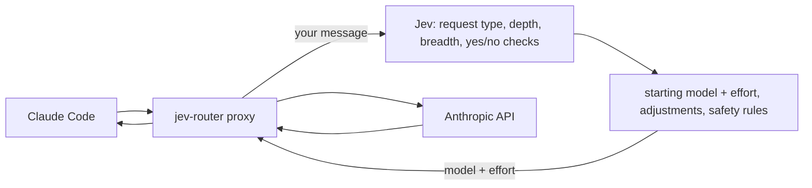
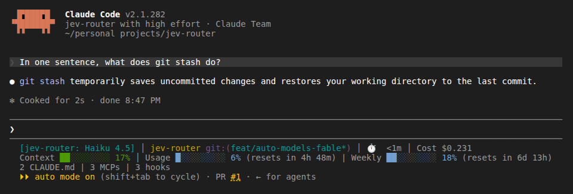
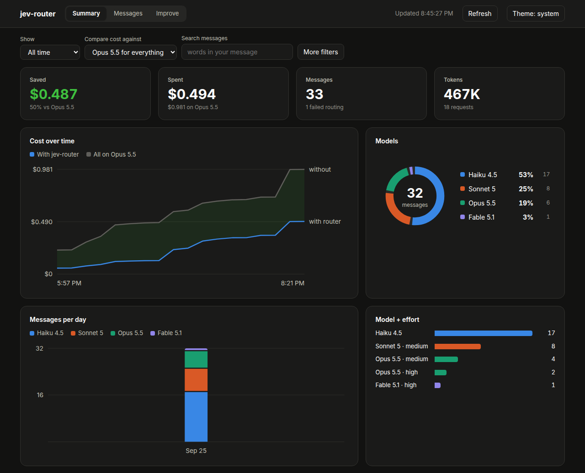
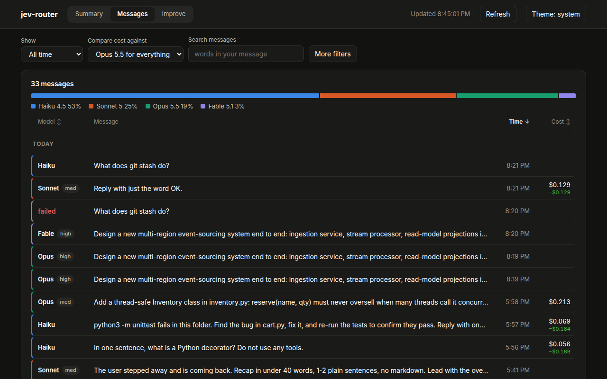
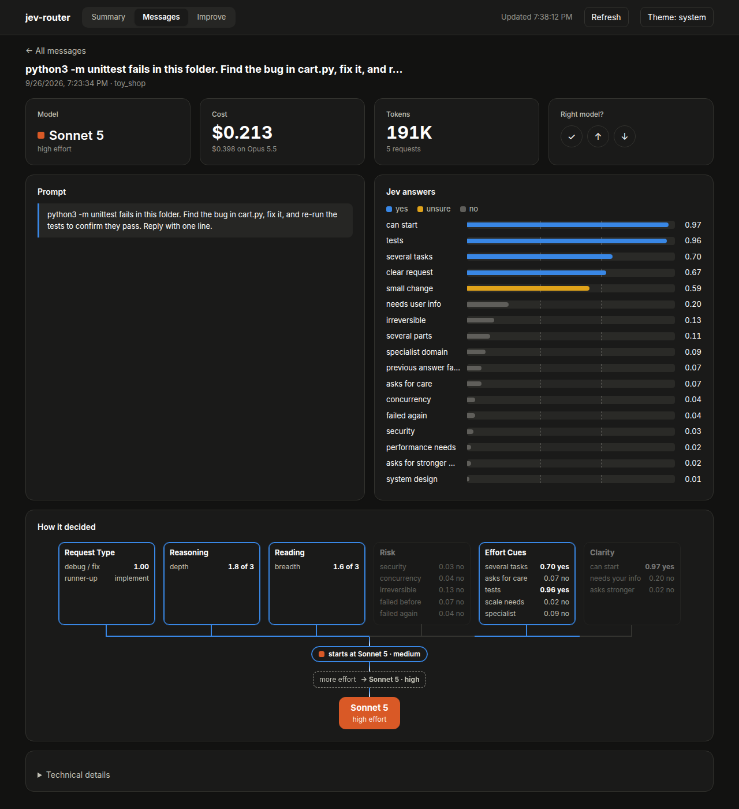

# jev-router

Automatic model and effort switching for [Claude Code](https://claude.com/claude-code). [TypeSafe Jev](https://docs.typesafe.ai) routes each message you send:

- **Haiku 4.5** for small questions;
- **Sonnet 5** (low, medium or high effort) for everyday work;
- **Opus 5.5** (medium, high, xhigh or max effort) for hard or risky work.

## Architecture



1. Claude Code's own side requests (prompt suggestions, recaps) and replies like "continue" or "yes, do it" skip Jev and stay on the current model. A model you name ("switch to opus high") is used for that turn.
2. Otherwise the proxy asks Jev, in one call (~0.4 s): what kind of request it is (explain code, review, plan / design, debug / fix, implement, chat, and so on, 13 in all), how much reasoning and how much reading it needs, and quick yes/no checks such as "does it touch security?" and "did the last answer fail?".
3. The request type sets a starting model and effort. Deep reasoning moves it to a stronger model; broad reading, "be thorough" or several tasks add effort. Haiku is used only when every signal says simple.
4. Safety rules can raise the choice. Security, concurrency or irreversible work (production, schema changes, rewriting git history) gets at least Opus. A failed fix gets one step more; a second failure gets a stronger model. An unclear request is capped at Sonnet low, which asks you first, only when two answers agree it lacks information only you have.
5. The request goes to Anthropic with the chosen model and effort, and the whole turn stays on that model.

The older rules (five decision trees and a median vote) still run on the same answers and are logged for comparison; `JEV_ROUTER_RULES=v1` serves them instead. `jev-router golden` scores both on 110 labelled prompts in `tests/golden.jsonl`: v2 puts 98% in the acceptable range (v1: 67%, with 30% sent to too weak a model).

**What goes to api.typesafe.ai:** your new message, up to 7 earlier text turns (2,000 characters each, no tool output, secrets redacted), the repository folder name, and the opening paragraph of its `CLAUDE.md` or `README.md` (up to 800 characters, redacted), so Jev knows what "this project" is. Set `JEV_ROUTER_REPO_SUMMARY=off` to leave the paragraph out.

## Install

You'll need Claude Code and a TypeSafe API key.

### Get a TypeSafe API key

1. Sign up at [console.typesafe.ai](https://console.typesafe.ai). Access is waitlisted, so a new account can take a while to be approved.
2. Once you're in, create a key on the [API keys page](https://console.typesafe.ai/keys).
3. Put it in `~/.config/jev-router/.env` as `TYPESAFE_API_KEY=...` (see below), or export `TYPESAFE_API_KEY`, which always wins.

Without a key, `jev-router claude` still starts Claude Code, just without routing.

**Prebuilt binary** (Linux x86_64 with glibc 2.39+, such as Ubuntu 24.04 or later). Download it from [Releases](https://github.com/xafold/jev-router/releases):

```bash
curl -L https://github.com/xafold/jev-router/releases/latest/download/jev-router-x86_64-linux.tar.gz | tar xz -C ~/.local/bin
mkdir -p ~/.config/jev-router && echo "TYPESAFE_API_KEY=your-key" > ~/.config/jev-router/.env
jev-router --version
```

**From source** (needs Rust):

```bash
git clone https://github.com/xafold/jev-router && cd jev-router
cp .env.example .env            # add your TYPESAFE_API_KEY
cargo build --release
ln -sfn "$PWD/target/release/jev-router" ~/.local/bin/jev-router
```

## Use

```bash
jev-router claude               # Claude Code with automatic switching
jev-router route "your prompt"  # dry run: which model would it pick, and why
jev-router log                  # recent decisions
```



The status line shows the model the router picked for the current turn.

To choose a model yourself, pick any model in `/model`. Pick **Jev Router** to go back to automatic.

## Dashboard

```bash
jev-router dashboard              # open http://127.0.0.1:8765
jev-router dashboard --port 9000  # use a different port
```

The dashboard is a local page that shows:
- which model handled each message, and why;
- roughly how much the router saved compared with using Opus for everything.

You can rate each choice as right, too weak or too strong. After about 20 ratings, the router quietly adjusts itself.



Every message, with the model and effort it got and what it cost:



Each message has a page showing the request type Jev picked, its reasoning and reading levels, Jev's yes/no answers, and any rule that changed the result (the screenshot below still shows the older tree vote):



## Versioning

Versions follow [semver](https://semver.org). The current version is in `Cargo.toml`, and `jev-router --version` prints it. Each release is tagged `vX.Y.Z` and comes with a binary.

## Tests

```bash
cargo test --release
```

## Credits

The proxy approach comes from [gargpratyush/jev-router](https://github.com/gargpratyush/jev-router) (MIT).
