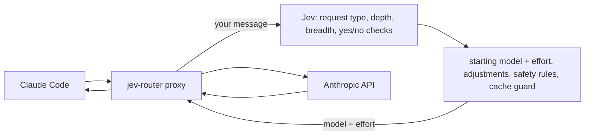
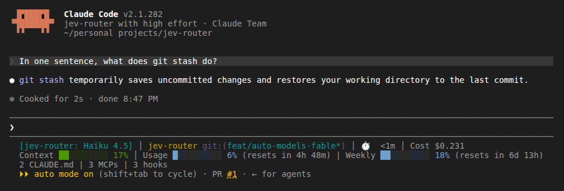
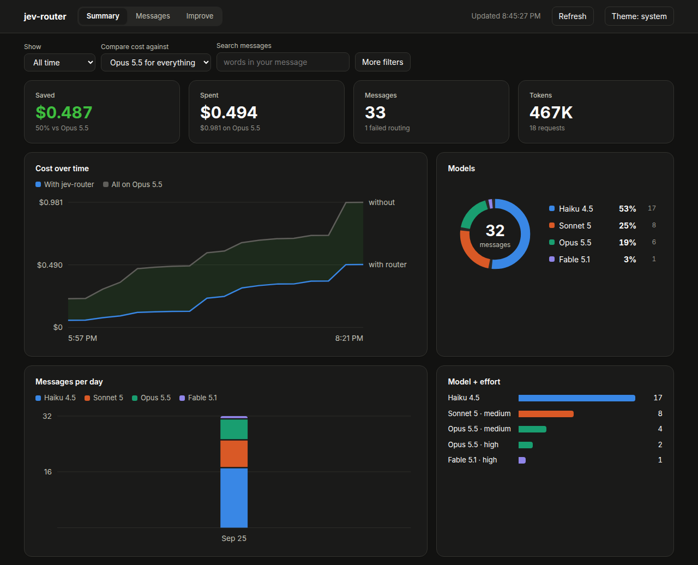
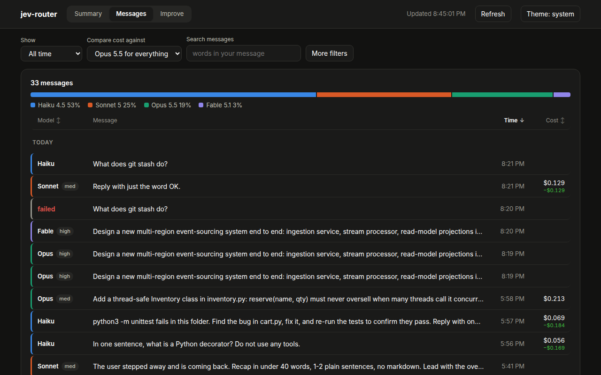
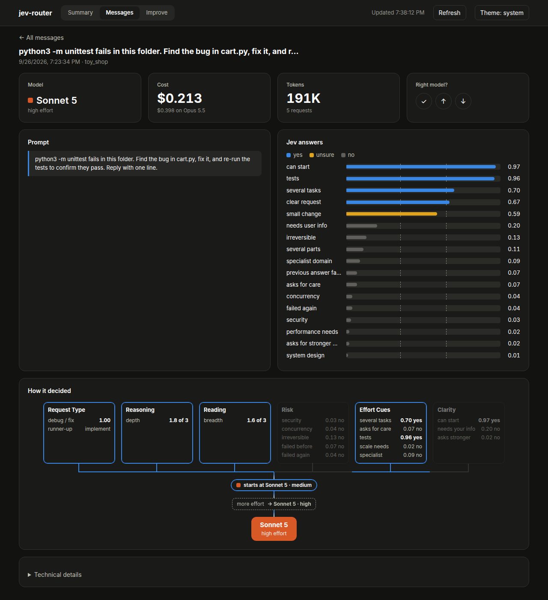

# jev-router

Automatic model and effort switching for [Claude Code](https://claude.com/claude-code). [TypeSafe Jev](https://docs.typesafe.ai) routes each message you send:

- **Haiku 4.5** for small questions;
- **Sonnet 5** (low, medium or high effort) for everyday work;
- **Opus 5.5** (medium, high, xhigh or max effort) for hard or risky work.

It is cache-aware: in a long conversation it won't switch models when that would throw away the prompt cache.

## Architecture


```mermaid
flowchart LR
  CC[Claude Code] --> P[jev-router proxy]
  P -->|your message| J[Jev: request type, depth, breadth, yes/no checks]
  J --> R[starting model + effort, adjustments, safety rules, cache guard]
  R -->|model + effort| P
  P --> A[Anthropic API]
  A --> P --> CC
```

1. **Skip Jev when it isn't needed.** Claude Code's side requests (prompt suggestions, recaps) and replies like "continue" or "yes, do it" stay on the current model. A model you name ("switch to opus high") is used for that turn.
2. **Ask Jev** in one call (~0.4 s): the request type (13 in all, such as explain code, review, plan / design, debug / fix, implement or chat), how much reasoning and reading it needs, and yes/no checks such as "does it touch security?" or "did the last answer fail?".
3. **Pick a model and effort.** The request type sets the start. Deep reasoning moves to a stronger model, and broad reading, "be thorough" or several tasks add effort. Haiku is used only when every signal says simple.
4. **Apply the safety rules.**
   - Security, concurrency or irreversible work (production, schema changes, rewriting git history) gets at least Opus.
   - A failed fix gets one step more, and a second failure gets a stronger model.
   - An unclear request is capped at Sonnet low, which asks you first. This happens only when two answers agree it lacks information only you have.
5. **Protect the prompt cache** (see below).
6. **Send the request** to Anthropic. The whole turn stays on that model.

### Cache-aware switching

Changing the model, or the top-level effort, in the middle of a conversation throws away the prompt cache. The next request then rewrites the whole history at up to 2x the input price. So once a conversation's cache is warm and holds more than 20k tokens:

- **Downgrades keep the current model.** Leaving Opus becomes Opus medium instead, since Opus 5.5 cache reads cost the same as Sonnet 5's.
- **Upgrades go ahead only when they're worth it:** the rewrite costs $0.25 or less, the conversation is leaving Haiku, or a safety rule or a model you named asks for it.
- **Opus 5.5 effort moves freely.** Each change goes in a per-message effort system message (beta `mid-conversation-output-config-2026-07-01`), which keeps the cache. Set `JEV_ROUTER_EFFORT_MESSAGES=off` to turn this off.

How the proxy tracks it:
- The cache size is the prompt size the API reported for the conversation's last request.
- A cache left idle longer than its TTL counts as cold, and then switching is free. The TTL (5 minutes or 1 hour) comes from Claude Code's `cache_control`.
- On Opus 5.5, the proxy also moves Claude Code's cache breakpoint off trailing system messages, so each turn reads the previous turn's cache.

In a 4-turn A/B run with the same prompts, cache writes fell from 75k to 16k tokens and the cost from $0.32 to $0.22.

**Older rules (v1):** five decision trees and a median vote, with the older "no downgrade past 20k tokens" cache rule. They run on the same answers and are logged for comparison; `JEV_ROUTER_RULES=v1` serves them instead. `jev-router golden` scores both on 110 labelled prompts in `tests/golden.jsonl`: v2 puts 98% in the acceptable range, v1 67% (with 30% sent to too weak a model).

**What goes to api.typesafe.ai:**
- your new message;
- up to 7 earlier text turns (2,000 characters each, no tool output, secrets redacted);
- the repository folder name;
- the opening paragraph of its `CLAUDE.md` or `README.md` (up to 800 characters, redacted), so Jev knows what "this project" is. Set `JEV_ROUTER_REPO_SUMMARY=off` to leave it out.

## Install

You'll need Claude Code and a TypeSafe API key.

### Get a TypeSafe API key

1. Sign up at [console.typesafe.ai](https://console.typesafe.ai). Access is waitlisted, so a new account can take a while to be approved.
2. Once you're in, create a key on the [API keys page](https://console.typesafe.ai/keys).
3. Put it in `~/.config/jev-router/.env` as `TYPESAFE_API_KEY=...` (see below), or export `TYPESAFE_API_KEY`, which always wins.

Without a key, `jev-router claude` still starts Claude Code, just without routing.

**Prebuilt binary** (Linux x86_64 with glibc 2.39+, such as Ubuntu 24.04 or later). Download it from [Releases](https://github.com/xafold/jev-router/releases):

```bash
curl -L https://github.com/xafold/jev-router/releases/latest/download/jev-router-x86_64-linux.tar.gz | tar xz -C ~/.local/bin
mkdir -p ~/.config/jev-router && echo "TYPESAFE_API_KEY=your-key" > ~/.config/jev-router/.env
jev-router --version
```

**From source** (needs Rust):

```bash
git clone https://github.com/xafold/jev-router && cd jev-router
cp .env.example .env            # add your TYPESAFE_API_KEY
cargo build --release
ln -sfn "$PWD/target/release/jev-router" ~/.local/bin/jev-router
```

## Use

```bash
jev-router claude               # Claude Code with automatic switching
jev-router route "your prompt"  # dry run: which model would it pick, and why
jev-router log                  # recent decisions
```



The status line shows the model the router picked for the current turn.

To choose a model yourself, pick any model in `/model`. Pick **Jev Router** to go back to automatic.

## Dashboard

```bash
jev-router dashboard              # open http://127.0.0.1:8765
jev-router dashboard --port 9000  # use a different port
```

The dashboard is a local page that shows:
- which model handled each message, and why;
- roughly how much the router saved compared with using Opus for everything;
- whether each message kept the prompt cache, and what keeping it saved.

You can rate each choice as right, too weak or too strong. After about 20 ratings, the router quietly adjusts itself.



Every message, with the model and effort it got and what it cost:



Each message has a page showing the request type Jev picked, its reasoning and reading levels, Jev's yes/no answers, and any rule that changed the result:



## Versioning

Versions follow [semver](https://semver.org). The current version is in `Cargo.toml`, and `jev-router --version` prints it. Each release is tagged `vX.Y.Z` and comes with a binary.

## Tests

```bash
cargo test --release
```
